# Museum Semantic Search

Proof-of-concept for searching museum collections using AI embeddings and AI-generated visual descriptions. Cross-modal search capabilities via SigLIP 2 and text search via Jina v3. Deployed on Vercel and Modal for GPU inference.

## Disclaimer

***This project is meant as a starting point for experimentation and discussion around the use of AI in museum collections search, and should not be taken as advocating a specific approach.***  

While AI can be used for "good" (See *["Improving the Search: Uncovering AI bias in digital collections"](https://www.aam-us.org/2025/06/29/improving-the-search-uncovering-ai-bias-in-digital-collections/)*), it can also perpetuate existing biases or create new ones.  My current personal experience is that AI-generated content can augment existing metadata but must be verified and edited by human experts.

## Dataset

Project limited to 5,280 Open Access artworks from The Metropolitan Museum of Art with classification type "Paintings" and available images.

- [The Metropolitan Museum of Art Open Access CSV](https://github.com/metmuseum/openaccess)
- [The Metropolitan Museum of Art Collection API](https://metmuseum.github.io/)

## Related

- Musefully ([website](https://musefully.org/), [github](https://github.com/derekphilipau/musefully)): Search across museums using Elasticsearch and Next.js
- [“Accessible Art Tags” GPT](https://www.derekau.net/this-vessel-does-not-exist/2023/12/21/accessible-art-ai-gpt): a specialized GPT that generates alt text and long descriptions following [Cooper Hewitt Guidelines for Image Description](https://www.cooperhewitt.org/cooper-hewitt-guidelines-for-image-description/).
- [OpenAI CLIP Embedding Similarity](https://www.derekau.net/this-vessel-does-not-exist/2023/8/11/openai-clip-embedding-similarity): Examples of [OpenAI CLIP](https://openai.com/index/clip/) Embeddings artwork similarity search.

### Related Projects

- [MuseRAG++: A Deep Retrieval-Augmented Generation Framework for Semantic Interaction and Multi-Modal Reasoning in Virtual Museums](https://www.researchsquare.com/article/rs-7281889/v1): RAG-powered museum chatbot
- National Museum of Norway Semantic Collection Search ([Website](https://beta.nasjonalmuseet.no/collection/), [Article](https://beta.nasjonalmuseet.no/2023/08/add-semantic-search-to-a-online-collection/)): Search via embeddings of GPT-4 Vision image descriptions.
- Semantic Art Search ([Github](https://github.com/KristianMSchmidt/semantic-art-search), [Website](https://semantic-art-search.com/)): Explore art through meaning-driven search 
- Sketchy Collections ([Github](https://github.com/psologub/sketchycollections), [Website](http://134.209.182.231:8000/)): CLIP-based image search tool that lets you explore artworks by drawing or uploading a picture

## Use of AI

### Visual Descriptions

Gemini 2.5 Flash was used to generate three types of visual descriptions: alt text, long description, and emoji summary. The prompt was inspired by [Cooper Hewitt Guidelines for Image Description](https://www.cooperhewitt.org/cooper-hewitt-guidelines-for-image-description/).

The system uses a two-pass approach:
1. **Generation Pass**: Multimodal Gemini 2.5 Flash with image and metadata input. Creates initial descriptions following accessibility guidelines.  [Full prompt here.](lib/descriptions/gemini.ts#L30)
2. **Editorial Pass**: Prompts Gemini 2.5 Flash again, this time only with the initial text outputs and the guidelines. Refines descriptions for consistency, removes biases, and ensures strict adherence to museum standards including objectivity, consistent word counts, and appropriate emoji selection. [Full prompt here.](lib/descriptions/gemini.ts#L171)

**Personal Conclusions**:
- In practice, the initial generation often deviates from the guidelines, and often contains cultural assumptions, interpretations, or subjective language. The secondary editorial pass is very helpful in ensuring high-quality, objective descriptions that strictly adhere to the Cooper Hewitt Guidelines.
- When combined with text embeddings search, visual descriptions significantly improve search relevance for queries in comparison to basic metadata keyword searches.  E.g. *"woman holding a fan"*, "man fighting a monster"*, etc.  See *"Mining Archetypes"* below for more examples.

### Visual Descriptions Example: [*The Death of Socrates*, Jacques Louis David, 1787](https://www.metmuseum.org/art/collection/search/436105)

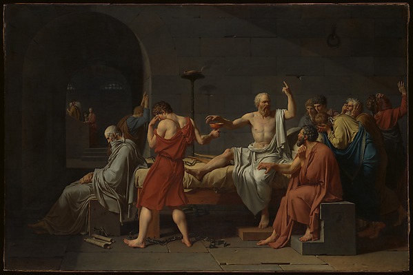

1. Generation Pass, Initial Visual Descriptions Multimodal Gemini 2.5 Flash output:

- **Alt Text**: *"Socrates, surrounded by grieving students, reaches for a cup of hemlock in a dimly lit prison cell"*
- **Long Description**: *"The painting depicts a dramatic scene within a dimly lit, stone-walled room. In the center, an elderly, muscular man with a white beard, identified as Socrates, sits upright on a bed, draped in a white cloth. He gestures upwards with his right hand, as if speaking, while his left hand reaches for a small, red cup offered by a younger, muscular man in a red tunic, who turns away with a pained expression. To the right of Socrates, several men are gathered, showing various states of distress. One man in a red robe sits on a stone block, looking down thoughtfully. Behind him, others express anguish, some covering their faces, others raising their hands in despair. To the left of Socrates, an older man with a white beard and gray robe sits slumped on a bench, his head bowed in sorrow. Further back, in a darker arched doorway, more figures are visible, including a woman being led away. On the floor in the foreground, near the slumped man, are two rolled scrolls and a broken chain. The room's architecture is simple, with stone blocks forming the walls and an arched opening leading to a darker area. A small, dark object hangs from the ceiling. The overall lighting is dim, with a subtle glow on the central figures."*
- **Emojis**: 🧔🍷😭⛓️📜

2. Editorial Pass, Gemini 2.5 Flash Editorially Revised Output:

- **Alt Text**: *"An elderly man reaches for a cup, surrounded by distressed figures in a dimly lit stone room"*
- **Long Description**: *"A dimly lit, stone-walled room contains multiple figures. In the center, an elderly, muscular man with a white beard sits upright on a bed, draped in a white cloth. He gestures upwards with his right hand, while his left hand reaches for a small, red cup. A younger, muscular man in a red tunic offers the cup, turning his head away from the elderly man with a downturned mouth. To the right of the central elderly man, several men are gathered, displaying varied postures. One man in a red robe sits on a stone block, looking downwards. Behind him, other figures cover their faces or raise their hands. To the left of the central elderly man, an older man with a white beard and gray robe sits slumped on a bench, his head bowed. Further back, in a darker arched doorway, more figures are visible, including a woman standing near another figure. On the floor in the foreground, near the slumped man, are two rolled scrolls and a broken chain. The room features stone block walls and an arched opening leading to a darker area. A small, dark object hangs from the ceiling. The overall lighting is dim, with a subtle glow on the central figures."*
- **Emojis**: 🧔🍷👥⛓️📜

- ***Editorial Changes Made***:
   - Alt Text: Removed specific name "Socrates."
   - Alt Text: Removed interpretive terms "grieving students," "hemlock," and "prison cell."
   - Alt Text: Replaced with objective visual descriptions like "distressed figures" and "stone room."
   - Alt Text: Adjusted word count to be closer to 15 words.
   - Long Description: Removed subjective phrase "The painting depicts a dramatic scene."
   - Long Description: Removed specific name "Socrates" and the phrase "identified as Socrates."
   - Long Description: Removed interpretive phrases such as "as if speaking," "pained expression," "various states of distress," "looking down thoughtfully," "express anguish," "raising their hands in despair," and "bowed in sorrow."
   - Long Description: Replaced character-specific references like "To the right of Socrates" with neutral spatial references like "To the right of the central elderly man."
   - Long Description: Rephrased "a woman being led away" to "a woman standing near another figure" to remove implied action/intent.
   - Long Description: Removed subjective judgment "The room's architecture is simple."
   - Long Description: Replaced emotional descriptions of figures with objective descriptions of their postures and expressions (e.g., "downturned mouth," "displaying varied postures," "cover their faces").
   - Emoji Summary: Removed "😭" emoji as it represents an emotion, which is explicitly forbidden.
   - Emoji Summary: Added "👥" emoji to represent the group of multiple figures, ensuring all main visual elements are covered objectively.

### Embeddings

Off-the-shelf models were used, presumably fine-tuning could produce more accurate and contextually relevant results.

**1. Text Embeddings**

Jina v3 ([`jinaai/jina-embeddings-v3`](https://jina.ai/embeddings/)) - 768 dimensions. Combines Met artwork metadata (title, artist, date, medium) with the AI-generated visual descriptions described above. Uses task-specific embeddings: "retrieval.passage" for indexing, "retrieval.query" for search.

**2. Image Embeddings**

SigLIP 2 ([`google/siglip2-base-patch16-224`](https://huggingface.co/google/siglip2-base-patch16-224)) - 768 dimensions. Cross-modal embeddings enabling text-to-image search in shared vector space. Allows multilingual natural language queries like *"woman looking into mirror"* or *"女人照镜子"* to find visually matching artworks.

### Software Development

AI was used to help quickly develop this software for the purpose of quickly prototyping and experimenting with different semantic search techniques.  It should not be taken as a good example of Next.js or proper Elasticsearch indexing or querying.  Museum collections search is much more complex and nuanced.  The [Musefully](https://musefully.org/) project is more reflective of good faceted search practices.

## Search Comparison

Despite sometimes questionable results, text embedding search with AI-Generated visual descriptions seems to work well in practice.  Image embedding search also shows promise, although it seems less reliable and often produces strange results.

Below are comparisons of keyword search, text embedding search, and image embedding search for the query *"woman looking into mirror"*.  

[Search for "woman looking into mirror"](https://museum-semantic-search.vercel.app/?q=woman+looking+into+mirror&keyword=true&hybrid=true&hybridMode=image&hybridBalance=0.5&models=jina_v3%2Csiglip2)

Out of a result set of 20:

- The conventional Elasticsearch keyword search over Met Museum metadata produces only 3 results that I consider highly relevant.
- Text embedding search using Jina v3 embeddings on combined metadata and AI-generated descriptions returns 13 excellent results, including a number of images where the reflection or mirror is not even visible.
- Image embedding search using SigLIP 2 cross-modal embeddings returns 8 highly-relevant results, including artworks where there's no actual mirror, but rather the concept of mirroring, for example [*"Portrait of a Woman with a Man at a Casement"* by Fra Filippo Lippi](https://www.metmuseum.org/art/collection/search/436896) and [*"Dancers, Pink and Green"* by Edgar Degas](https://www.metmuseum.org/art/collection/search/436140).

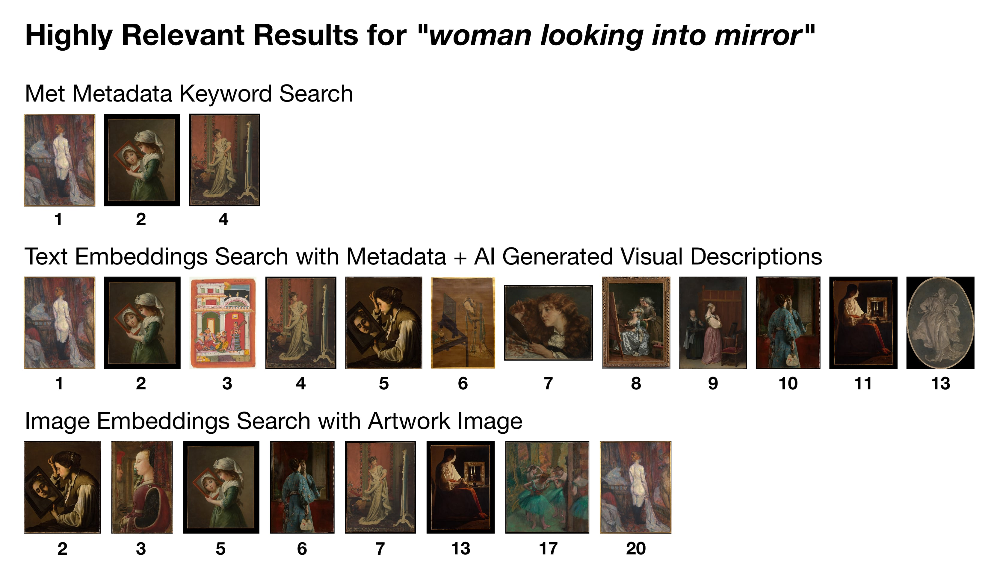

Results that I found exciting are highlighted in the image below.  A number of these I probably would have missed if browsing through images. 

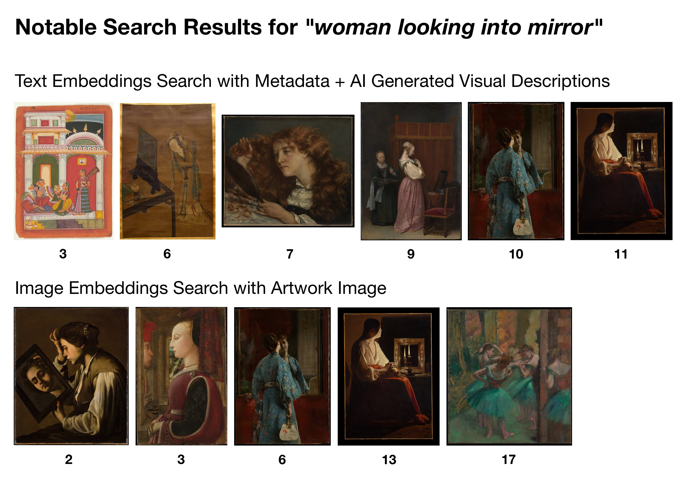

<table>
<tr>
<td width="250">
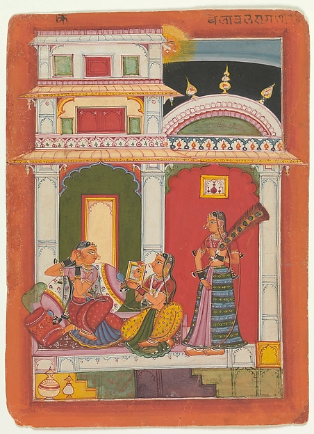
</td>
<td>
Difficult to see: the woman on the left is looking into a mirror.

<a href="https://www.metmuseum.org/art/collection/search/37854">Vilaval Ragini: Folio from a ragamala series (Garland of Musical Modes)</a>

</td>
</tr>

<tr>
<td width="250">
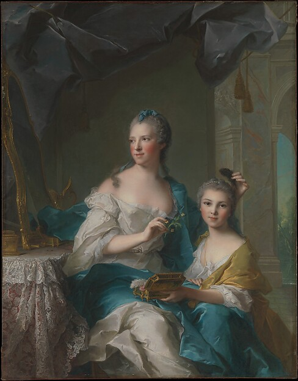
</td>
<td>

I thought the AI-generated visual description and/or text embeddings had it wrong, but there is indeed a mirror in the painting and it's possible the main figure is looking into it.

<a href="https://www.metmuseum.org/art/collection/search/437181">Madame Marsollier and Her Daughter</a> by Jean Marc Nattier

</td>
</tr>

<tr>
<td width="250">
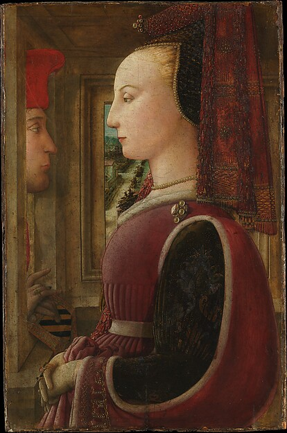
</td>
<td>

Perhaps the woman is not looking into a mirror, but it does feel like a *mirroring*.

<a href="https://www.metmuseum.org/art/collection/search/436896">Portrait of a Woman with a Man at a Casement</a> by Fra Filippo Lippi

</td>
</tr>
</table>

## Mining Archetypes

Intrigued by the results for ["woman looking into mirror"](https://museum-semantic-search.vercel.app/?q=woman+looking+into+mirror), I started to search for other art history archetypes to explore across cultures & time.  Although the embedding searches are often inaccurate, interspersed are some surprisingly relevant results that would not have been possible with keyword search alone.

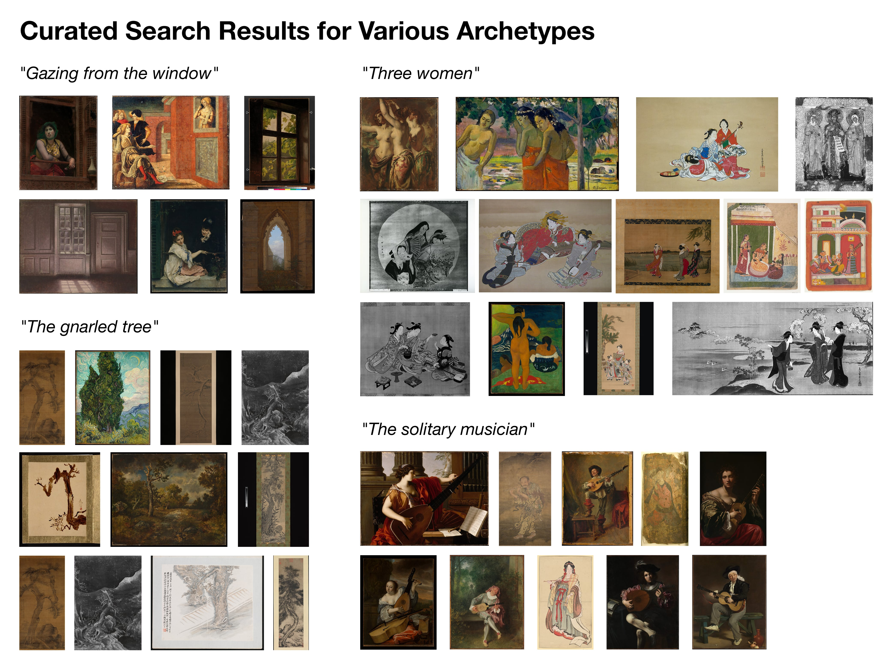

Searches:

- ["Three Women"](https://museum-semantic-search.vercel.app/?q=three+women)
- ["Gazing from the window"](https://museum-semantic-search.vercel.app/?q=gazing+from+the+window)
- ["The gnarled tree"](https://museum-semantic-search.vercel.app/?q=the+gnarled+tree)
- ["Mother and child"](https://museum-semantic-search.vercel.app/?q=mother+and+child)
- ["Old man with a beard"](https://museum-semantic-search.vercel.app/?q=old+man+with+a+beard)
- ["Person fighting a monster"](https://museum-semantic-search.vercel.app/?q=person+fighting+a+monster)
- ["People on a bridge"](https://museum-semantic-search.vercel.app/?q=people+on+a+bridge)
- ["A banquet scene"](https://museum-semantic-search.vercel.app/?q=a+banquet+scene)
- ["Man on a horse"](https://museum-semantic-search.vercel.app/?q=man+on+a+horse)
- ["Ruins in a landscape"](https://museum-semantic-search.vercel.app/?q=ruins+in+a+landscape)
- ["Sleeping person"](https://museum-semantic-search.vercel.app/?q=sleeping+person)
- ["The reclining nude"](https://museum-semantic-search.vercel.app/?q=the+reclining+nude)
- ["Man in armor"](https://museum-semantic-search.vercel.app/?q=man+in+armor)
- ["A person with a dog"](https://museum-semantic-search.vercel.app/?q=a+person+with+a+dog)
- ["Flowers in a vase"](https://museum-semantic-search.vercel.app/?q=flowers+in+a+vase)

### AI-Generated Emojis

Sometimes strangely accurate revealing details I missed, at other times questionable and problematic, and often hilarious.  Dubious practical use but fun.

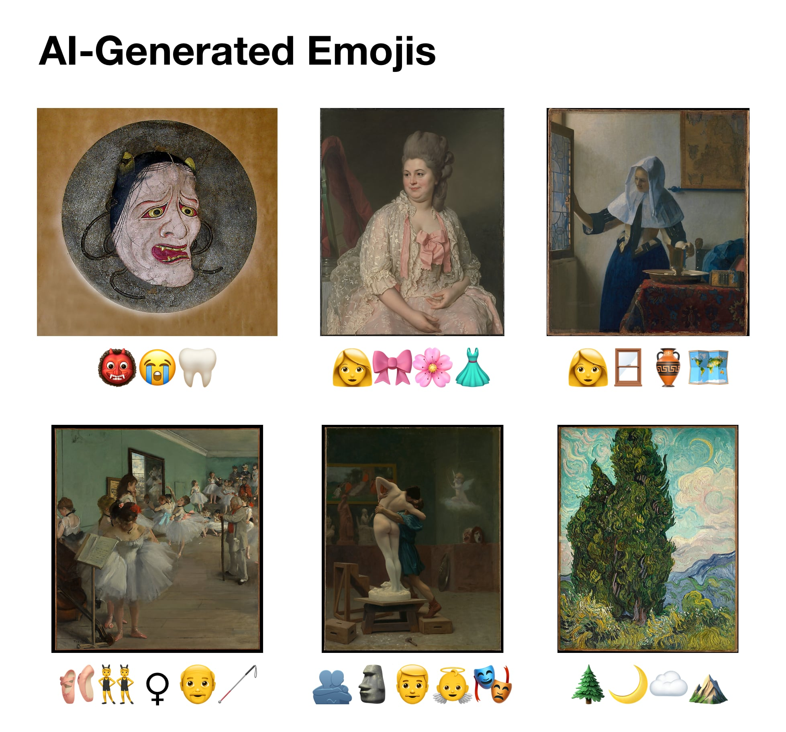

## Visualize Embeddings

The `/visualize` page lets you explore how artworks cluster in the embedding space. You can see the entire collection as dots on a 2D map, where similar artworks appear near each other. Uses UMAP to reduce the 768-dimensional embeddings down to 2D while preserving relationships.

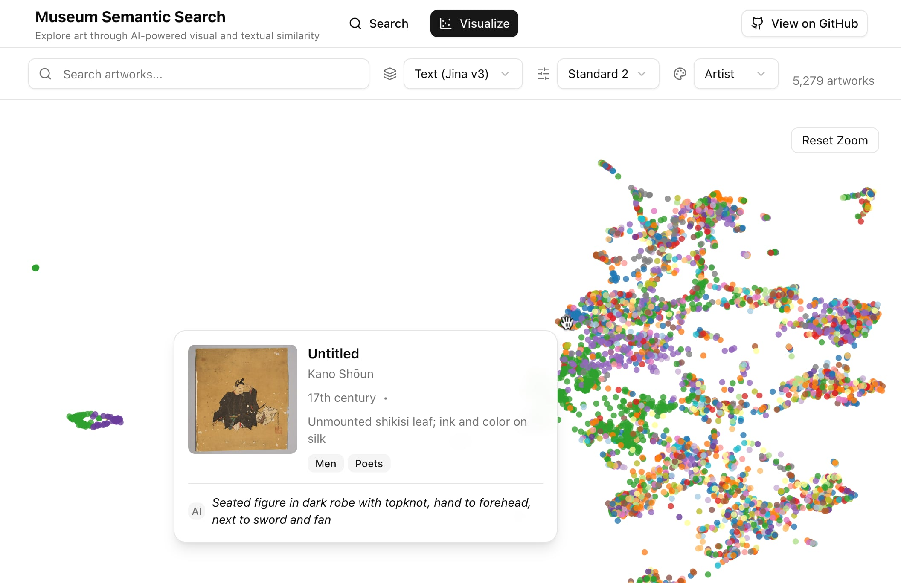

- Each dot represents one artwork in the collection
- Distance between dots shows semantic similarity, closer dots are more similar
- Search to highlight relevant results. Larger, brighter dots rank higher
- Color dots by artist, period, or tags to reveal patterns

### Example Journeys

Try these search progressions to see how the embedding space organizes concepts:
- **"landscape"** > **"mountain"** > **"snowy mountain"**
- **"woman"** > **"woman smiling"** > **"woman with hat"**
- **"blue"** > **"blue sky"** > **"stormy sky"**

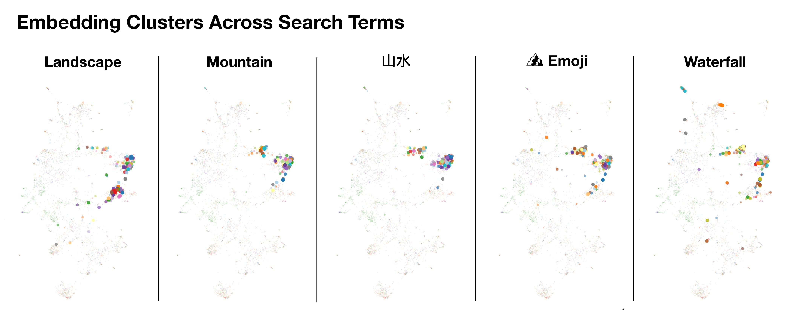

## Search Types

### 1. **Keyword Search**
Traditional Elasticsearch text search using BM25 scoring across artwork metadata (title, artist, medium, etc.) and optional AI-generated visual descriptions.

### 2. **Semantic Search** 
Vector similarity search using pre-computed embeddings:
- **Jina v3 Text**: Advanced text search combining artwork metadata with AI-generated descriptions (768 dimensions)
- **SigLIP 2 Cross-Modal**: True text-to-image search using Google's SigLIP 2 model (768 dimensions) - enables natural language queries like "red car in snow" or "mourning scene"

### 3. **Hybrid Search**
Combines keyword and semantic search with user-adjustable balance control:

- **Text Mode**: Keyword + Jina v3 text embeddings
- **Image Mode**: Keyword + SigLIP 2 cross-modal embeddings  
- **Both Mode**: Keyword + both embedding types using RRF
- Balance slider: 0% = pure keyword, 100% = pure semantic, 50% = equal weight

### 4. **Image Search**
Upload an image to find visually similar artworks using SigLIP 2 embeddings.

## Similar Artworks Algorithms

The artwork detail pages display similar artworks using four different algorithms:

### 1. **Metadata Similarity** (Elasticsearch-based)
Finds artworks with similar structured metadata using art historical principles:
- **Artist** (weight: 10) - Same artist indicates strong connection
- **Date/Period** (weight: 7) - Temporal proximity using Gaussian decay (±25 years)
- **Medium** (weight: 6) - Similar materials and techniques
- **Classification** (weight: 5) - Same artwork type (painting, sculpture, etc.)
- **Department** (weight: 4) - Museum curatorial groupings
- **Culture/Nationality** (weight: 4) - Cultural and geographic connections
- **Period/Dynasty** (weight: 3) - Art historical movements

### 2. **Jina v3 Text Similarity**
Uses 768-dimensional text embeddings to find semantically similar artworks based on:
- Artwork metadata (title, artist, date, medium)
- AI-generated visual descriptions
- Contextual understanding of art terminology

### 3. **SigLIP 2 Visual Similarity**
Uses 768-dimensional cross-modal embeddings to find visually similar artworks:
- Analyzes visual features like composition, color, style
- Works across different media and periods
- Captures visual patterns independent of metadata

### 4. **Combined Similarity**

Fuses all three similarity types using weighted Reciprocal Rank Fusion (RRF):
- **35%** Jina v3 text embeddings - semantic understanding
- **35%** SigLIP 2 visual embeddings - visual appearance
- **30%** Elasticsearch metadata - art historical context

*Note that Elasticsearch has [native RRF](https://www.elastic.co/docs/reference/elasticsearch/rest-apis/reciprocal-rank-fusion) but it's only available in the Enter­prise plan.*

### 5. **AI Curated Similarity** (Pre-computed LLM Reranking)

The AI curation process:
1. Retrieves top 20 candidates from metadata and text embeddings searches, 5 candidates from image embeddings search
2. Removes duplicates and presents candidates without scores to avoid bias
3. Applies art historical expertise to select truly meaningful connections
4. Enforces diversity rules (max 3 per artist, max 8 per similarity type)
5. Returns up to 20 curated recommendations with confidence scores

Uses Gemini 2.5 Flash to intelligently select and rank similar artworks:
- **Cross-cultural connections**: Discovers relationships across time periods and cultures (e.g., Gauguin's Tahitian Madonna with Renaissance Madonnas)
- **Thematic relationships**: Identifies shared subjects and motifs beyond surface similarities
- **Visual intelligence**: Considers composition, style, and emotional resonance
- **Diversity-aware**: Limits over-representation of single artists or similarity types
- **Explainable**: Each recommendation includes a brief explanation of the connection

[Full prompt here.](scripts/met/7-generate-similar-artworks-met.ts#L259)

### AI-Curated Similarity Example

See Example here: [Holy Family with Saint Anne, French Painter (17th century)](https://museum-semantic-search.vercel.app/artwork/met_436344)

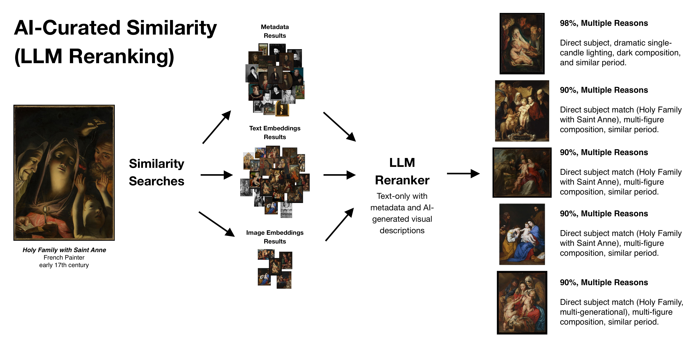

For this example, relying only on metadata, the keyword search does a poor job of finding relevant similar artworks, pulling in various works by unknown "French Painter".  Text & image embeddings results are better, especially with theme and style.  The AI-curated results are perhaps best in my opinion, but I'm not an art historian and not familiar enough with the collection to make an educated judgment.

## Additional Features

- **Multi-model Comparison**: Side-by-side results from different search types
- **Visual Search**: Search by image similarity using multimodal embeddings  

## Model Performance Notes

In developing this project I tried out a number of different models:

1. **Jina Embeddings** performed very well across all their models:
   - **JinaCLIP v2** provided highly relevant results for visual art search
   - **Jina v3** delivered excellent text-only semantic search capabilities
   - **Jina v4** matched Google's performance for multimodal search with 2048-dimensional embeddings

2. **SigLIP vs CLIP**: SigLIP 2 over CLIP for several reasons:
   - Better performance on natural language queries
   - Improved localization capabilities
   - More robust to variations in query phrasing
   - Consistent 768-dimensional output matching Jina v3

3. **Cohere Embed 4** did not produce results as relevant as other models for art-related queries.

4. **Voyage Multimodal 3** had significant rate limiting issues on the free tier (3 requests/minute). Search results were not as relevant as Jina models or Google Vertex AI for art-related queries.

### Multimodal Embeddings

I tested multimodal embeddings that combined artwork metadata (title, artist, medium, etc.) with images. Testing revealed that both Jina v4 and Google Vertex produce nearly identical embeddings whether using image-only or image+text inputs.  Apparently the image features dominate so heavily that text contributes negligibly to the final embedding. More research needed. 

Eventually I found that separate image-only embeddings and text-only embeddings worked better.  And hybrid search that ranks results from keyword, image embedding, and text embedding searches, worked best.

## Installation

See [INSTALLATION.md](INSTALLATION.md) for detailed setup instructions including prerequisites, environment configuration, and deployment steps.

## License

This project is MIT licensed. Museum data is used according to each institution's open access policies.