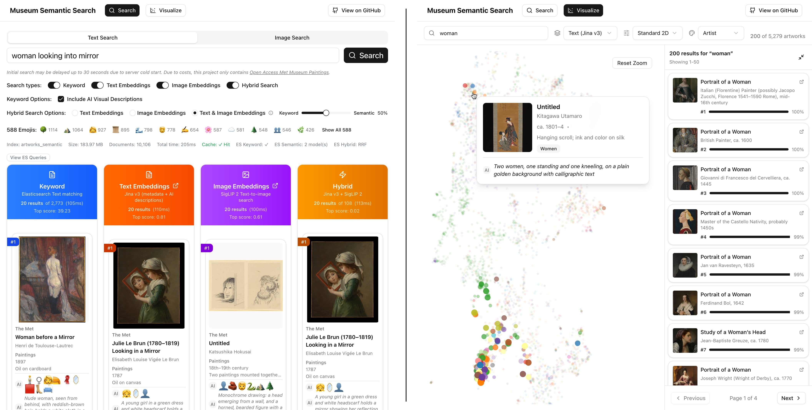
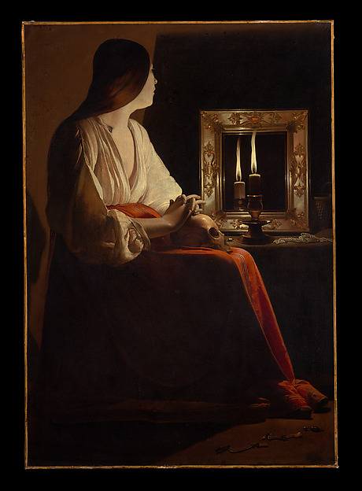
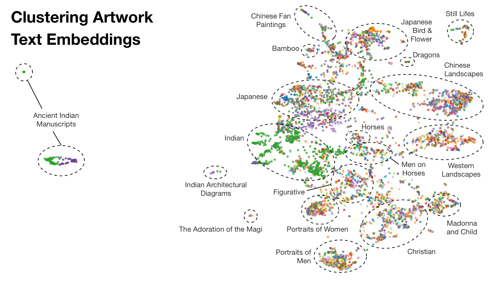
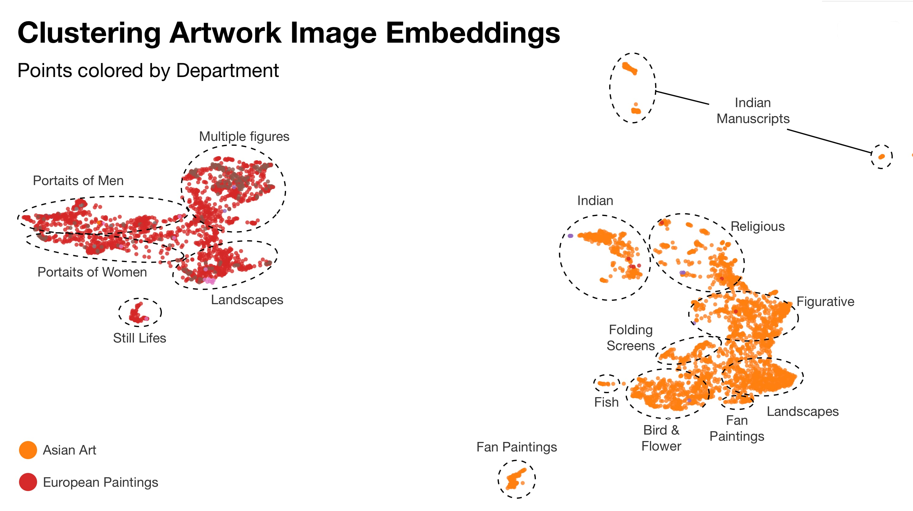
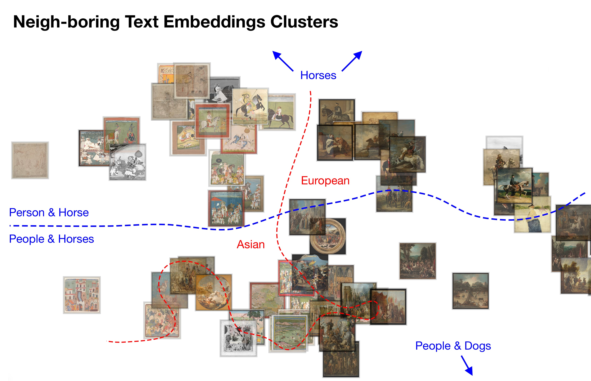
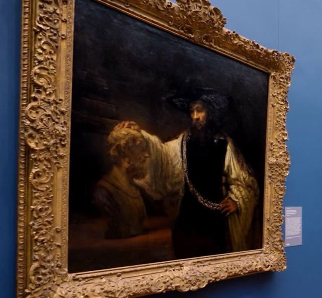
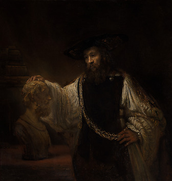

# Museum Semantic Search

Prototype exploring semantic search for museum collections using AI-generated visual descriptions and embeddings.

***Note: This project was recently switched to use Jina text (v3) and CLIP v2 embeddings, and uses Jina API rather than a custom Modal service. The demo website may have different results than the screenshots in this document.***

## Features

- Search artworks using multilingual natural language queries
- Explore the embedding space with interactive visualizations
- Compare traditional & semantic search techniques side-by-side
- Upload an image to find similar artworks

## Quick Links

- [Try the Demo](https://museum-semantic-search.vercel.app/) - Search 5,280 Open Access Met paintings
- [Explore the Embeddings Visualization](https://museum-semantic-search.vercel.app/visualize) - See how artworks cluster by text & image similarity
- [Technical Guide & Setup](TECHNICAL_GUIDE.md) - Setup and development guide
- [Trusted Context Prototype Plan](docs/TrustedContextPrototypePlan.md) - Offline capsule pipeline for grounded chat answers

## API Keys

Set the following environment variables before running the embedding scripts:

- `GOOGLE_GEMINI_API_KEY` for Gemini 2.5 Flash visual description generation and other LLM tooling.
- `JINA_API_KEY` for Jina text (v3) and CLIP v2 embeddings (run `npm install sharp` locally once so oversized images can be compressed automatically).

## Capsule-Based Chat Prototype

We are extending the project with an offline, citation-first chat experience for individual artworks. Each prototype artwork (starting with *The Death of Socrates*) receives a **capsule**: canonical metadata, visual description chunks we already generate, and vetted narrative snippets sourced from cached Wikipedia/Wikidata entries. Snippets are stored with embeddings in a dedicated Elasticsearch index so the runtime can retrieve 6–12 grounded passages, require inline citations, and gracefully deflect outside that approved scope—no live web calls, no human editors in the loop. See the [Trusted Context Prototype Plan](docs/TrustedContextPrototypePlan.md) for the full build pipeline and storage schema. (Getty vocabularies can be layered on later if we decide to expand beyond the MVP.)

- Run `npx tsx scripts/trusted_context/suggest-links.ts --artifact-config …` (Gemini, loads `GOOGLE_GEMINI_API_KEY`/`GEMINI_API_KEY` from `.env*`) to identify the Wikipedia titles to mirror.
- Mirror those pages once with `npx tsx scripts/trusted_context/fetch-wikipedia.ts --suggestions …` (the script will try a Wikipedia search fallback if the suggested title is slightly off).
- Generate the capsule bundle and snippet JSONL with `node scripts/trusted_context/build-capsule.mjs --artifact-config …`, then ingest the snippets into Elasticsearch.
- Create snippet embeddings with `npx tsx scripts/trusted_context/embed-snippets.ts --input …` (Jina v3 document embeddings written beside the source JSONL).
- Index the snippets with `node scripts/trusted_context/index-snippets.mjs --artifact …` (defaults to `ELASTICSEARCH_KNOWLEDGE_INDEX=knowledge_snippets`).
- Retrieve grounded passages at runtime via `POST /api/knowledge-search` (body: `{ artifactId, query, size? }`), which returns top snippets + citations for the chat prompt.

## Example Searches

Try these queries to see how semantic search finds artworks that traditional keyword search might miss:

["Three Women"](https://museum-semantic-search.vercel.app/?q=three+women), 
["Gazing from the window"](https://museum-semantic-search.vercel.app/?q=gazing+from+the+window),
["The gnarled tree"](https://museum-semantic-search.vercel.app/?q=the+gnarled+tree),
["Mother and child"](https://museum-semantic-search.vercel.app/?q=mother+and+child),
["Old man with a beard"](https://museum-semantic-search.vercel.app/?q=old+man+with+a+beard),
["Person fighting a monster"](https://museum-semantic-search.vercel.app/?q=person+fighting+a+monster),
["People on a bridge"](https://museum-semantic-search.vercel.app/?q=people+on+a+bridge),
["A banquet scene"](https://museum-semantic-search.vercel.app/?q=a+banquet+scene),
["Man on a horse"](https://museum-semantic-search.vercel.app/?q=man+on+a+horse),
["Ruins in a landscape"](https://museum-semantic-search.vercel.app/?q=ruins+in+a+landscape),
["Sleeping person"](https://museum-semantic-search.vercel.app/?q=sleeping+person),
["The reclining nude"](https://museum-semantic-search.vercel.app/?q=the+reclining+nude),
["Man in armor"](https://museum-semantic-search.vercel.app/?q=man+in+armor),
["A person with a dog"](https://museum-semantic-search.vercel.app/?q=a+person+with+a+dog),
["Flowers in a vase"](https://museum-semantic-search.vercel.app/?q=flowers+in+a+vase)

### Disclaimer

While AI can enhance search capabilities, it can also perpetuate existing biases or create new ones. (See *["Improving the Search: Uncovering AI bias in digital collections"](https://www.aam-us.org/2025/06/29/improving-the-search-uncovering-ai-bias-in-digital-collections/)*) AI-generated content should ideally be verified and edited by human experts. Museum collections search is complex and nuanced.  This project is a quick prototype, see the [Musefully](https://musefully.org/) project which is more reflective of proper faceted search.

### Dataset

5,280 Open Access paintings with images from The Metropolitan Museum of Art's Open Access collection. *[View the full Met Open Access dataset](https://github.com/metmuseum/openaccess)*

## AI Visual Descriptions

AI is used to generate three types of descriptions for each artwork that adhere to the [Cooper Hewitt Guidelines for Image Description](https://www.cooperhewitt.org/cooper-hewitt-guidelines-for-image-description/):

1. **Alt text** (~15 words) - Concise accessibility description
2. **Long description** (100-300 words) - Detailed visual elements
3. **Emoji summary** (3-8 emojis) - Visual elements as symbols

**Two-pass quality control:**
- **Generation pass** - AI creates initial descriptions from the image. [Full prompt](lib/descriptions/gemini.ts#L30)
- **Editorial pass** - AI reviews and removes bias, interpretation, or cultural assumptions. [Full prompt](lib/descriptions/gemini.ts#L171)

### Visual Descriptions Example: [*The Death of Socrates*, Jacques Louis David, 1787](https://www.metmuseum.org/art/collection/search/436105)

#### 1. Generation Pass, Initial Visual Descriptions Multimodal Gemini 2.5 Flash output:

- **Alt Text**: *"Socrates, surrounded by grieving students, reaches for a cup of hemlock in a dimly lit prison cell"*
- **Long Description**: *"The painting depicts a dramatic scene within a dimly lit, stone-walled room. In the center, an elderly, muscular man with a white beard, identified as Socrates, sits upright on a bed, draped in a white cloth. He gestures upwards with his right hand, as if speaking, while his left hand reaches for a small, red cup offered by a younger, muscular man in a red tunic, who turns away with a pained expression. To the right of Socrates, several men are gathered, showing various states of distress. One man in a red robe sits on a stone block, looking down thoughtfully. Behind him, others express anguish, some covering their faces, others raising their hands in despair. To the left of Socrates, an older man with a white beard and gray robe sits slumped on a bench, his head bowed in sorrow. Further back, in a darker arched doorway, more figures are visible, including a woman being led away. On the floor in the foreground, near the slumped man, are two rolled scrolls and a broken chain. The room's architecture is simple, with stone blocks forming the walls and an arched opening leading to a darker area. A small, dark object hangs from the ceiling. The overall lighting is dim, with a subtle glow on the central figures."*
- **Emojis**: 🧔🍷😭⛓️📜

#### 2. Editorial Pass, Gemini 2.5 Flash Editorially Revised Output:

- **Alt Text**: *"An elderly man reaches for a cup, surrounded by distressed figures in a dimly lit stone room"*
- **Long Description**: *"A dimly lit, stone-walled room contains multiple figures. In the center, an elderly, muscular man with a white beard sits upright on a bed, draped in a white cloth. He gestures upwards with his right hand, while his left hand reaches for a small, red cup. A younger, muscular man in a red tunic offers the cup, turning his head away from the elderly man with a downturned mouth. To the right of the central elderly man, several men are gathered, displaying varied postures. One man in a red robe sits on a stone block, looking downwards. Behind him, other figures cover their faces or raise their hands. To the left of the central elderly man, an older man with a white beard and gray robe sits slumped on a bench, his head bowed. Further back, in a darker arched doorway, more figures are visible, including a woman standing near another figure. On the floor in the foreground, near the slumped man, are two rolled scrolls and a broken chain. The room features stone block walls and an arched opening leading to a darker area. A small, dark object hangs from the ceiling. The overall lighting is dim, with a subtle glow on the central figures."*
- **Emojis**: 🧔🍷👥⛓️📜

***Editorial Changes Made***:
- Alt Text: Removed specific name "Socrates."
- Alt Text: Removed interpretive terms "grieving students," "hemlock," and "prison cell."
- Alt Text: Replaced with objective visual descriptions like "distressed figures" and "stone room."
- Alt Text: Adjusted word count to be closer to 15 words.
- Long Description: Removed subjective phrase "The painting depicts a dramatic scene."
- Long Description: Removed specific name "Socrates" and the phrase "identified as Socrates."
- Long Description: Removed interpretive phrases such as "as if speaking," "pained expression," "various states of distress," "looking down thoughtfully," "express anguish," "raising their hands in despair," and "bowed in sorrow."
- Long Description: Replaced character-specific references like "To the right of Socrates" with neutral spatial references like "To the right of the central elderly man."
- Long Description: Rephrased "a woman being led away" to "a woman standing near another figure" to remove implied action/intent.
- Long Description: Removed subjective judgment "The room's architecture is simple."
- Long Description: Replaced emotional descriptions of figures with objective descriptions of their postures and expressions (e.g., "downturned mouth," "displaying varied postures," "cover their faces").
- Emoji Summary: Removed "😭" emoji as it represents an emotion, which is explicitly forbidden.
- Emoji Summary: Added "👥" emoji to represent the group of multiple figures, ensuring all main visual elements are covered objectively.

### Visual Descriptions Limitations

The strict prompts & two-pass editorial process help reduce bias and subjective interpretation, but visual elements may be misidentified or missed entirely.  The primary consideration is if, in spite of minor inaccuracies, the descriptions still improve search relevance, especially when used in text embeddings.

<table>
<tr>
<td width="200">

</td>
<td>

Excerpt from visual description of <a href="https://www.metmuseum.org/art/collection/search/436839">"The Penitent Magdalen" by Georges de La Tour</a>:

*"The mirror reflects **two lit candles**, their flames appearing as elongated, bright vertical streaks against the dark background within the frame. One candle is visible on a dark, turned wooden candlestick directly in front of the mirror, while the other is only seen as a reflection."*

Here, the model seems confused by the mirror and incorrectly identifies two candles when there is only one.

</td>
</tr>

</table>

### Visual Descriptions Textual Analysis

Besides enabling better semantic search, the AI-generated visual descriptions can be used as a dataset for textual analysis. Below are some examples of frequent words used in the Met Paintings.

<table style="width:100%; table-layout:fixed;">
 <tr>
  <td>
    <strong>COLORS</strong>
    <ol>
      <li>"dark" - 15672</li>
      <li>"light" - 11173</li>
      <li>"red" - 8175</li>
      <li>"white" - 7778</li>
      <li>"brown" - 7256</li>
      <li>"green" - 6400</li>
      <li>"blue" - 5273</li>
      <li>"black" - 4225</li>
      <li>"gold" - 3706</li>
      <li>"gray" - 1907</li>
    </ol>
  </td>
  <td>
    <strong>EMOJIS</strong>
    <ol>
      <li>🌳 - 1112</li>
      <li>⛰ - 1060</li>
      <li>👩 - 985</li>
      <li>📜 - 891</li>
      <li>🌊 - 795</li>
      <li>🧔 - 781</li>
      <li>✍ - 652</li>
      <li>🌸 - 582</li>
      <li>☁ - 580</li>
      <li>🌲 - 548</li>
    </ol>
  </td>
</tr>
<tr>
  <td>
    <strong>ANIMALS</strong>
    <ol>
      <li>"bird" - 1305</li>
      <li>"horse" - 853</li>
      <li>"dog" - 380</li>
      <li>"fish" - 210</li>
      <li>"fly" - 146</li>
      <li>"deer" - 144</li>
      <li>"monkey" - 142</li>
      <li>"elephant" - 122</li>
      <li>"crane" - 116</li>
      <li>"lion" - 114</li>
    </ol>
  </td>
  <td>
    <strong>MYTHOLOGICAL</strong>
    <ol>
      <li>"creature" - 317</li>
      <li>"dragon" - 126</li>
      <li>"beast" - 12</li>
      <li>"demon" - 11</li>
      <li>"griffin" - 6</li>
      <li>"sphinx" - 3</li>
      <li>"centaur" - 3</li>
      <li>"monster" - 3</li>
      <li>"satyr" - 3</li>
      <li>"devil" - 3</li>
    </ol>
  </td>
 </tr>
</table>

## AI-Generated Emojis

Sometimes strangely accurate revealing details I missed, at other times questionable and problematic, and often hilarious.  Dubious practical use but fun.

## Search Comparison

Below are comparisons of keyword search, text embedding search, and image embedding search for the query *"woman looking into mirror"*.  

[Search for "woman looking into mirror"](https://museum-semantic-search.vercel.app/?q=woman+looking+into+mirror&keyword=true&hybrid=true&hybridMode=image&hybridBalance=0.5&models=jina_text%2Cjina_clip)

Out of a result set of 20:

- The conventional Elasticsearch keyword search over Met Museum metadata produces only 3 results that I consider highly relevant.
- Text embedding search using Jina embeddings on combined metadata and AI-generated descriptions returns 13 excellent results, including a number of images where the reflection or mirror is not even visible.
- Image embedding search returns 8 highly-relevant results, including artworks where there's no actual mirror, but perhaps the concept of mirroring, for example [*"Portrait of a Woman with a Man at a Casement"* by Fra Filippo Lippi](https://www.metmuseum.org/art/collection/search/436896) and [*"Dancers, Pink and Green"* by Edgar Degas](https://www.metmuseum.org/art/collection/search/436140).

Results that I found exciting are highlighted in the image below.  A number of these I probably would have missed if browsing through images. 

<table>
<tr>
<td width="250">

</td>
<td>
Difficult to see: the woman on the left is looking into a mirror.

<a href="https://www.metmuseum.org/art/collection/search/37854">Vilaval Ragini: Folio from a ragamala series (Garland of Musical Modes)</a>

</td>
</tr>

<tr>
<td width="250">

</td>
<td>

I thought the AI-generated visual description and/or text embeddings had it wrong, but there is indeed a mirror in the painting and it's possible the main figure is looking into it.

<a href="https://www.metmuseum.org/art/collection/search/437181">Madame Marsollier and Her Daughter</a> by Jean Marc Nattier

</td>
</tr>

<tr>
<td width="250">

</td>
<td>

Perhaps the woman is not looking into a mirror, but it does feel like a *mirroring*.

<a href="https://www.metmuseum.org/art/collection/search/436896">Portrait of a Woman with a Man at a Casement</a> by Fra Filippo Lippi

</td>
</tr>
</table>

## Visualize Embeddings

The `/visualize` page shows the entire collection as dots on a 2D map, where similar artworks cluster together based on shared themes, styles, and subjects. For example, "Portraits of Men" and "Portraits of Women" appear near each other, as do "Horses" and "Men on Horses". Distinct traditions like "Indian Manuscripts" form separate regions.

- Each dot represents one artwork in the collection
- Distance between dots shows semantic similarity, closer dots are more similar
- Search to highlight relevant results. Larger, brighter dots rank higher
- Color dots by artist, period, tags, or department to reveal patterns

## Search Types

### 1. **Keyword Search**
Traditional Elasticsearch text search using BM25 scoring across artwork metadata (title, artist, medium, etc.) and optional AI-generated visual descriptions.

### 2. **Semantic Search** 
Vector similarity search using pre-computed embeddings:
- **Jina Text v3**: Semantic search combining artwork metadata with AI-generated descriptions using `jina-embeddings-v3` (default 1024 dimensions; set `JINA_TEXT_EMBED_DIM=1536` to experiment with higher precision)
- **Jina CLIP v2**: Cross-modal search powered by Jina's CLIP v2 model (default 1024 dimensions; adjust `JINA_CLIP_EMBED_DIM` to experiment with larger vectors) for natural language ↔ image matching

### 3. **Hybrid Search**
Combines keyword and semantic search with user-adjustable balance control:

- **Text Mode**: Keyword + Jina text embeddings
- **Image Mode**: Keyword + Jina CLIP image embeddings  
- **Both Mode**: Keyword + both embedding families using RRF
- Balance slider: 0% = pure keyword, 100% = pure semantic, 50% = equal weight

### 4. **Image Search**

By clicking on "Image Search" in the search bar, you can upload an image to find visually similar artworks using Jina CLIP embeddings. This helps museum-goers find related works from a photo they capture in the galleries or projects like [Google Arts & Culture's "Art Selfie"](https://artsandculture.google.com/camera/selfie).

<table>
<tr>
<td width="250">
Uploaded Image:

</td>
<td>
First Search Result:

<a href="https://www.metmuseum.org/art/collection/search/437394">"Aristotle with a Bust of Homer"</a> by Rembrandt (Rembrandt van Rijn)

</td>
</tr>

</table>

## Similar Artworks Algorithms

The artwork detail pages display similar artworks using four different algorithms:

### 1. **Metadata Similarity** (Elasticsearch-based)
Finds artworks with similar structured metadata using art historical principles:
- **Artist** (weight: 10) - Same artist indicates strong connection
- **Date/Period** (weight: 7) - Temporal proximity using Gaussian decay (±25 years)
- **Medium** (weight: 6) - Similar materials and techniques
- **Classification** (weight: 5) - Same artwork type (painting, sculpture, etc.)
- **Department** (weight: 4) - Museum curatorial groupings
- **Culture/Nationality** (weight: 4) - Cultural and geographic connections
- **Period/Dynasty** (weight: 3) - Art historical movements

### 2. **Jina Text Similarity**
Uses Jina text embeddings to find semantically similar artworks based on:
- Artwork metadata (title, artist, date, medium)
- AI-generated visual descriptions
- Contextual understanding of art terminology

### 3. **Jina CLIP Visual Similarity**
Uses Jina CLIP embeddings to find visually similar artworks:
- Analyzes visual features like composition, color, style
- Works across different media and periods
- Captures visual patterns independent of metadata

### 4. **Combined Similarity**

Fuses all three similarity types using weighted Reciprocal Rank Fusion (RRF):
- **35%** Jina text embeddings - semantic understanding
- **35%** Jina CLIP embeddings - visual appearance
- **30%** Elasticsearch metadata - art historical context

*Note that Elasticsearch has [native RRF](https://www.elastic.co/docs/reference/elasticsearch/rest-apis/reciprocal-rank-fusion) but it's only available in the Enter­prise plan.*

### 5. **AI Curated Similarity** (Pre-computed LLM Reranking)

The AI curation process:
1. Retrieves trimmed candidate pools (metadata × 20, text × 20, image × 10) from Elasticsearch
2. Applies reciprocal rank fusion with tuned weights (metadata 30%, text 40%, image 30%) and keeps the top ~24 unique works
3. Sends prompts to Gemini 2.5 Flash with bounded concurrency, including evidence for each candidate (source, rank, score)
4. Gemini selects up to 12 finalists, assigns similarity type + confidence, and explains the relationship
5. The JSONL output is ingested into Elasticsearch so the UI can show curated recommendations instantly

Uses Gemini 2.5 Flash to intelligently select and rank similar artworks:
- **Cross-cultural connections**: Discovers relationships across time periods and cultures (e.g., Gauguin's Tahitian Madonna with Renaissance Madonnas)
- **Thematic relationships**: Identifies shared subjects and motifs beyond surface similarities
- **Visual intelligence**: Considers composition, style, and emotional resonance
- **Diversity-aware**: Limits over-representation of single artists or similarity types
- **Explainable**: Each recommendation includes a brief explanation grounded in the supplied evidence

[Prompt builder lives here.](scripts/met/7-generate-similar-artworks-met.ts)

### AI-Curated Similarity Example

See Example here: [Holy Family with Saint Anne, French Painter (17th century)](https://museum-semantic-search.vercel.app/artwork/met_436344)

For this example, relying only on metadata, the keyword search does a poor job of finding relevant similar artworks, pulling in various works by unknown "French Painter".  Text & image embeddings results are better, especially with theme and style.  The AI-curated results are perhaps best in my opinion, but I'm not an art historian and not familiar enough with the collection to make an educated judgment.

## Technical Guide & Setup

See [TECHNICAL_GUIDE.md](TECHNICAL_GUIDE.md) for technical details & setup instructions including prerequisites, environment configuration, and deployment steps.

## Previous Work

- Musefully ([website](https://musefully.org/), [github](https://github.com/derekphilipau/musefully)): Search across museums using Elasticsearch and Next.js
- [“Accessible Art Tags” GPT](https://www.derekau.net/this-vessel-does-not-exist/2023/12/21/accessible-art-ai-gpt): a specialized GPT that generates alt text and long descriptions following [Cooper Hewitt Guidelines for Image Description](https://www.cooperhewitt.org/cooper-hewitt-guidelines-for-image-description/).
- [OpenAI CLIP Embedding Similarity](https://www.derekau.net/this-vessel-does-not-exist/2023/8/11/openai-clip-embedding-similarity): Examples of [OpenAI CLIP](https://openai.com/index/clip/) Embeddings artwork similarity search.

## Related Projects

- [MuseRAG++: A Deep Retrieval-Augmented Generation Framework for Semantic Interaction and Multi-Modal Reasoning in Virtual Museums](https://www.researchsquare.com/article/rs-7281889/v1): RAG-powered museum chatbot
- National Museum of Norway Semantic Collection Search ([Website](https://beta.nasjonalmuseet.no/collection/), [Article](https://beta.nasjonalmuseet.no/2023/08/add-semantic-search-to-a-online-collection/)): Search via embeddings of GPT-4 Vision image descriptions.
- Semantic Art Search ([Github](https://github.com/KristianMSchmidt/semantic-art-search), [Website](https://semantic-art-search.com/)): Explore art through meaning-driven search 
- Sketchy Collections ([Github](https://github.com/psologub/sketchycollections), [Website](http://134.209.182.231:8000/)): CLIP-based image search tool that lets you explore artworks by drawing or uploading a picture

## License

MIT licensed. Museum data used according to The Metropolitan Museum of Art's [open access policy](https://www.metmuseum.org/about-the-met/policies-and-documents/open-access).
