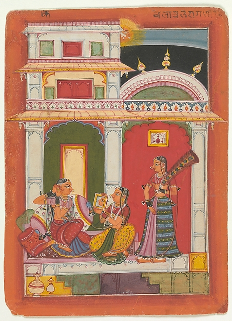

# Museum Semantic Search

Proof-of-concept for searching museum collections using AI embeddings and AI-generated visual descriptions. Cross-modal search capabilities via SigLIP 2 and text search via Jina v3. Deployed on Vercel and Modal for GPU inference.

## Disclaimer

***This project is meant as a starting point for experimentation and discussion around the use of AI in museum collections search, and should not be taken as advocating a specific approach.***  

While AI can be used for "good" (See *["Improving the Search: Uncovering AI bias in digital collections"](https://www.aam-us.org/2025/06/29/improving-the-search-uncovering-ai-bias-in-digital-collections/)*), it can also perpetuate existing biases or create new ones.  My current personal experience is that AI-generated content can augment existing metadata but must be verified and edited by human experts.

## Dataset

Project limited to ~5300 Open Access artworks with classification type "Paintings".

- [The Metropolitan Museum of Art Open Access CSV](https://github.com/metmuseum/openaccess)
- [The Metropolitan Museum of Art Collection API](https://metmuseum.github.io/)

## Related

- Musefully ([website](https://musefully.org/), [github](https://github.com/derekphilipau/musefully)): Search across museums using Elasticsearch and Next.js
- [“Accessible Art Tags” GPT](https://www.derekau.net/this-vessel-does-not-exist/2023/12/21/accessible-art-ai-gpt): a specialized GPT that generates alt text and long descriptions following [Cooper Hewitt Guidelines for Image Description](https://www.cooperhewitt.org/cooper-hewitt-guidelines-for-image-description/).
- [OpenAI CLIP Embedding Similarity](https://www.derekau.net/this-vessel-does-not-exist/2023/8/11/openai-clip-embedding-similarity): Examples of [OpenAI CLIP](https://openai.com/index/clip/) Embeddings artwork similarity search.

### Related Projects

- [MuseRAG++: A Deep Retrieval-Augmented Generation Framework for Semantic Interaction and Multi-Modal Reasoning in Virtual Museums](https://www.researchsquare.com/article/rs-7281889/v1): RAG-powered museum chatbot
- National Museum of Norway Semantic Collection Search ([Website](https://beta.nasjonalmuseet.no/collection/), [Article](https://beta.nasjonalmuseet.no/2023/08/add-semantic-search-to-a-online-collection/)): Search via embeddings of GPT-4 Vision image descriptions.
- Semantic Art Search ([Github](https://github.com/KristianMSchmidt/semantic-art-search), [Website](https://semantic-art-search.com/)): Explore art through meaning-driven search 
- Sketchy Collections ([Github](https://github.com/psologub/sketchycollections), [Website](http://134.209.182.231:8000/)): CLIP-based image search tool that lets you explore artworks by drawing or uploading a picture

## Use of AI

### Visual Descriptions

Gemini Flash 2.5 was used to generate three types of visual descriptions: alt text, long description, and emoji summary.  The prompt was inspired by [Cooper Hewitt Guidelines for Image Description](https://www.cooperhewitt.org/cooper-hewitt-guidelines-for-image-description/) but could use further refinement.

Prompt:

```
Generate museum-quality accessibility descriptions for this artwork image.

GENERAL RULES (apply to all descriptions):
- Describe only what is visible, not interpretations or symbolism
- For people: describe appearance without assumptions about identity
- Avoid geographic/cultural labels unless describing specific visible features
- Do not assume geographic origin (e.g. East Asian)
- Use clear, common language (avoid technical jargon)
- Never mention metadata (artist, date) unless visible in the image
- Focus on the artwork's visual content, not the physical condition or mounting of the piece

ALT TEXT (10-20 words):
- One concise phrase capturing the essential visual content
- Start with the most important element
- No ending punctuation

LONG DESCRIPTION (100-300 words):
- Progress from general to specific details
- Follow spatial logic (top-to-bottom, left-to-right, or center-outward)
- Include: colors (common names), composition, sizes, spatial relationships
- Transcribe any visible text exactly

EMOJI SUMMARY (2-8 emojis):
- Select emojis that would help someone quickly understand what they'd see
- Main visual elements in order of importance
- ONE emoji per subject (🧔 not 👨+🧔 for bearded man) or group of subjects
- Focus only on content in the artwork, never include display emojis like 🏛️⚱🎨🖼️
- Avoid color-only emojis like 💛,🔴,🟦 unless color is the primary subject
- Choose specific over generic (🌲🌊⛰️ not 🏞️)
```

### Embeddings

Off-the-shelf models were used, presumably fine-tuning could produce more accurate and contextually relevant results.

**1. Text Embeddings**

Jina v3 ([`jinaai/jina-embeddings-v3`](https://jina.ai/embeddings/)) - 768 dimensions. Combines Met artwork metadata (title, artist, date, medium) with the AI-generated visual descriptions described above. Uses task-specific embeddings: "retrieval.passage" for indexing, "retrieval.query" for search.

**2. Image Embeddings**

SigLIP 2 ([`google/siglip2-base-patch16-224`](https://huggingface.co/google/siglip2-base-patch16-224)) - 768 dimensions. Cross-modal embeddings enabling text-to-image search in shared vector space. Allows multilingual natural language queries like *"woman looking into mirror"* or *"女人照镜子"* to find visually matching artworks.

### Software Development

AI was used to help quickly develop this software for the purpose of quickly prototyping and experimenting with different semantic search techniques.  It should not be taken as a good example of Next.js or proper Elasticsearch indexing or querying.  Museum collections search is much more complex and nuanced.  The [Musefully](https://musefully.org/) project is more reflective of good faceted search practices.

## Search Comparison

Despite sometimes questionable results, text embedding search with AI-Generated visual descriptions seems to work well in practice.  Image embedding search also shows promise, although it seems less reliable and often produces strange results.

Below are comparisons of keyword search, text embedding search, and image embedding search for the query *"woman looking into mirror"*.  

Out of a result set of 20:

- The conventional Elasticsearch keyword search over Met Museum metadata produces only 3 results that I consider highly relevant.
- Text embedding search using Jina v3 embeddings on combined metadata and AI-generated descriptions returns 13 excellent results, including a number of images where the reflection or mirror is not even visible.
- Image embedding search using SigLIP 2 cross-modal embeddings returns 8 highly-relevant results, including artworks where there's no actual mirror, but rather the concept of mirroring, for example [*"Portrait of a Woman with a Man at a Casement"* by Fra Filippo Lippi](https://www.metmuseum.org/art/collection/search/436896) and [*"Dancers, Pink and Green"* by Edgar Degas](https://www.metmuseum.org/art/collection/search/436140).


Results that I found exciting are highlighted in the image below.  A number of these I probably would have missed if browsing through images. 


<table>
<tr>
<td width="50%">

</td>
<td width="50%">
Difficult to see: the woman on the right is looking into a mirror.

<a href="https://www.metmuseum.org/art/collection/search/37854">Vilaval Ragini: Folio from a ragamala series (Garland of Musical Modes)</a>

</td>
</tr>
<tr>
<td width="50%">

</td>
<td width="50%">

Perhaps the woman is not looking into a mirror, but it does feel like a *mirroring*.

<a href="https://www.metmuseum.org/art/collection/search/436896">Portrait of a Woman with a Man at a Casement</a> by Fra Filippo Lippi

</td>
</tr>
</table>

### AI-Generated Emojis

Sometimes strangely accurate revealing details I missed, at other times questionable and problematic, and often hilarious.  Dubious practical use but fun.


## Architecture Overview

The system uses a modern, scalable architecture:
- **Unified Embeddings API**: Single Modal deployment serving both SigLIP 2 and Jina v3 embeddings
- **Optimized Search**: Each user query makes exactly ONE API call to get all needed embeddings
- **Pre-computed Embeddings**: Image embeddings are generated offline and stored in Elasticsearch
- **Real-time Query Processing**: Text queries are embedded on-demand via Modal's GPU infrastructure

## Search Types

### 1. **Keyword Search**
Traditional Elasticsearch text search using BM25 scoring across artwork metadata (title, artist, medium, etc.) and optional AI-generated visual descriptions.

### 2. **Semantic Search** 
Vector similarity search using pre-computed embeddings:
- **Jina v3 Text**: Advanced text search combining artwork metadata with AI-generated descriptions (768 dimensions)
- **SigLIP 2 Cross-Modal**: True text-to-image search using Google's SigLIP 2 model (768 dimensions) - enables natural language queries like "red car in snow" or "mourning scene"

### 3. **Hybrid Search**
Combines keyword and semantic search with user-adjustable balance control:

- **Text Mode**: Keyword + Jina v3 text embeddings
- **Image Mode**: Keyword + SigLIP 2 cross-modal embeddings  
- **Both Mode**: Keyword + both embedding types using RRF
- Balance slider: 0% = pure keyword, 100% = pure semantic, 50% = equal weight

### 4. **Image Search**
Upload an image to find visually similar artworks using SigLIP 2 embeddings.

## Similar Artworks Algorithms

The artwork detail pages display similar artworks using four different algorithms:

### 1. **Metadata Similarity** (Elasticsearch-based)
Finds artworks with similar structured metadata using art historical principles:
- **Artist** (weight: 10) - Same artist indicates strong connection
- **Date/Period** (weight: 7) - Temporal proximity using Gaussian decay (±25 years)
- **Medium** (weight: 6) - Similar materials and techniques
- **Classification** (weight: 5) - Same artwork type (painting, sculpture, etc.)
- **Department** (weight: 4) - Museum curatorial groupings
- **Culture/Nationality** (weight: 4) - Cultural and geographic connections
- **Dimensions** (weight: 3) - Similar physical scale (±20% tolerance)
- **Period/Dynasty** (weight: 3) - Art historical movements

### 2. **Jina v3 Text Similarity**
Uses 768-dimensional text embeddings to find semantically similar artworks based on:
- Artwork metadata (title, artist, date, medium)
- AI-generated visual descriptions
- Contextual understanding of art terminology

### 3. **SigLIP 2 Visual Similarity**
Uses 768-dimensional cross-modal embeddings to find visually similar artworks:
- Analyzes visual features like composition, color, style
- Works across different media and periods
- Captures visual patterns independent of metadata

### 4. **Combined Similarity**

Fuses all three similarity types using weighted Reciprocal Rank Fusion (RRF):
- **35%** Jina v3 text embeddings - semantic understanding
- **35%** SigLIP 2 visual embeddings - visual appearance
- **30%** Elasticsearch metadata - art historical context

*Note that Elasticsearch has [native RRF](https://www.elastic.co/docs/reference/elasticsearch/rest-apis/reciprocal-rank-fusion) but it's only available in the Enter­prise plan.*

## Additional Features

- **Multi-model Comparison**: Side-by-side results from different search types
- **Visual Search**: Search by image similarity using multimodal embeddings  

## Model Performance Notes

In developing this project I tried out a number of different models:

1. **Jina Embeddings** performed very well across all their models:
   - **JinaCLIP v2** provided highly relevant results for visual art search
   - **Jina v3** delivered excellent text-only semantic search capabilities
   - **Jina v4** matched Google's performance for multimodal search with 2048-dimensional embeddings

2. **SigLIP vs CLIP**: SigLIP 2 over CLIP for several reasons:
   - Better performance on natural language queries
   - Improved localization capabilities
   - More robust to variations in query phrasing
   - Consistent 768-dimensional output matching Jina v3

3. **Cohere Embed 4** did not produce results as relevant as other models for art-related queries.

4. **Voyage Multimodal 3** had significant rate limiting issues on the free tier (3 requests/minute). Search results were not as relevant as Jina models or Google Vertex AI for art-related queries.

### Multimodal Embeddings

I tested multimodal embeddings that combined artwork metadata (title, artist, medium, etc.) with images. Testing revealed that both Jina v4 and Google Vertex produce nearly identical embeddings whether using image-only or image+text inputs.  Apparently the image features dominate so heavily that text contributes negligibly to the final embedding. More research needed. 

Eventually I found that separate image-only embeddings and text-only embeddings worked better.  And hybrid search that ranks results from keyword, image embedding, and text embedding searches, worked best.

## Installation

See [INSTALLATION.md](INSTALLATION.md) for detailed setup instructions including prerequisites, environment configuration, and deployment steps.

## Possible Future Improvements

- Native Elasticsearch integration for embeddings via Open Inference API
- Support for additional collections
- Real-time embedding generation during indexing
- Fine-tuned models

## License

This project is MIT licensed. Museum data is used according to each institution's open access policies.